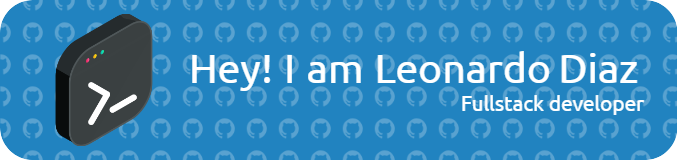

Bienvenid@ al GitHub de LDiazDev

En mi perfil, espero construir una colección de proyectos y contribuciones que muestren mi progreso y esfuerzo por alcanzar la excelencia técnica. De esta manera, no solo registro mi avance, sino que también creo un espacio que pueda inspirar a otros desarrolladores a mejorar sus propias habilidades y a unirse a la comunidad de código abierto, siempre con un enfoque en el crecimiento y la colaboración.

<!--
**LeonardoDiazO/LeonardoDiazO** is a ✨ _special_ ✨ repository because its `README.md` (this file) appears on your GitHub profile.

Here are some ideas to get you started:

- 🔭 I’m currently working on ...
- 🌱 I’m currently learning ...
- 👯 I’m looking to collaborate on ...
- 🤔 I’m looking for help with ...
- 💬 Ask me about ...
- 📫 How to reach me: ...
- 😄 Pronouns: ...
- ⚡ Fun fact: ...
-->
